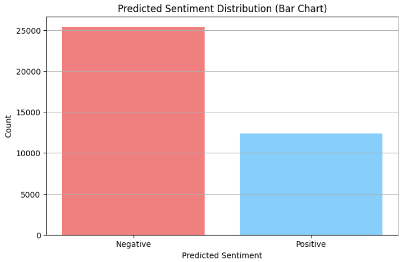
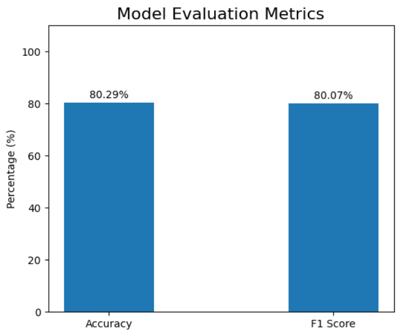
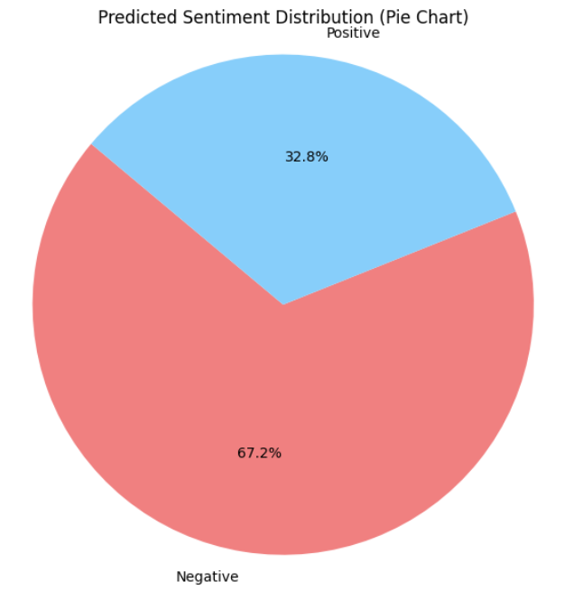
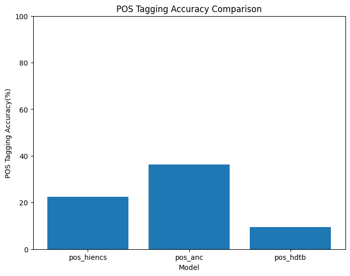

# Big Data-Powered Sentiment Analysis for Code-Mixed Hindi-English Tweets

This project presents a scalable big data pipeline to analyze sentiment in code-mixed Hindi-English tweets, addressing challenges like language switching, transliteration, and non-standard grammar. Utilizing Apache HBase, Spark NLP, PySpark MLlib, and IndicBERT, the pipeline preprocesses, indexes, and classifies tweets, providing robust insights into public sentiment on social media.

## Team: Big Data Enthusiasts

- Sarang P. Kadakia (sk11634) – Team Lead
- Vishwajeet Kulkarni (vk2630)
- Asmita Sonavane (as20428)

## Project Objectives

- Develop a scalable preprocessing pipeline using Big Data tools.
- Implement domain-agnostic sentiment classification for Hinglish tweets.
- Ensure accurate classification using IndicBERT.
- Evaluate performance via Accuracy and Weighted F1 Score.

## Technologies Used

| Component          | Tool / Framework                      |
|--------------------|----------------------------------------|
| Data Storage       | Apache HBase, Hadoop HDFS              |
| Processing         | Spark NLP, PySpark MLlib               |
| Tokenization & NLP | Ekphrasis, Spark POS models            |
| Modeling           | IndicBERT (Hinglish support)           |
| Evaluation         | Accuracy, F1-Score, IndicGLUE          |

## Repository Structure

```
├── datasets/                          # Raw, cleaned, and processed Excel files
│   ├── cleaned_file.xlsx
│   ├── cleaned_output_stage1.xlsx
│   ├── final_dataframe.xlsx
│   └── ...
├── images/                            # Visualizations for analysis
│   ├── bargraph_predicted_labels.png
│   ├── evaluation_acc_f1.png
│   ├── pie_chart_predicted_labels.png
│   ├── pos_comparision.png
│   └── ...
├── model/                             # Trained model artifacts (IndicBERT)
├── bigdataenthusiasts-project.ipynb   # Full pipeline implementation
├── Big Data Presentation_Spring 2025.pptx
├── ProjectProposal_TeamBigDataEnthusiasts_Revised.pdf
└── README.md
```

## Project Flow

### 1. Data Collection & Storage

- Utilized AI4Bharat Mann Ki Baat dataset with over 100,000 tweets across various domains.
- Stored tweets and metadata in Apache HBase.
- Managed high-volume storage using Hadoop HDFS.

### 2. Preprocessing Pipeline

- Performed tokenization and transliteration with Spark NLP.
- Handled noise using Ekphrasis and a custom Hinglish dictionary.
- Created features such as `has_negation` and `stopword_percentage`.

### 3. Feature Engineering

- Extracted TF-IDF features using HashingTF and IDF.
- Selected top 100 features via ChiSqSelector.
- Merged with structured features like POS tags.

### 4. Modeling: IndicBERT Fine-Tuning

- Employed Spark NLP’s IndicBERT embeddings.
- Trained for 50 epochs on GPU with a 70:30 train-test split.
- Achieved Accuracy: 80.29%, Weighted F1 Score: 80.07%.

### 5. Evaluation & Visualization

- Analyzed sentiment distribution, frequent Hinglish terms, and code-mix lengths.
- Utilized IndicGLUE for multilingual robustness checks.

## Results and Insights

### Accuracy & F1-Score

- Accuracy: 80.29%
- Weighted F1 Score: 80.07%

### Sample Visualizations

#### Sentiment Distribution (Bar Chart)


#### Model Evaluation Metrics


#### Sentiment Distribution (Pie Chart)


#### POS Tagging Accuracy Comparison


## Future Scope

- Extend support to other Indian languages like Tamil, Bengali, and Marathi.
- Expand the pipeline to include data from Facebook, Instagram, and YouTube.
- Develop real-time dashboards using Spark Streaming and Hive.
- Integrate explainability tools (SHAP/LIME) for production insights.

## Run the Code

```bash
# Install dependencies
pip install pyspark spark-nlp ekphrasis transformers

# Open notebook
jupyter notebook bigdataenthusiasts-project.ipynb
```

> **Note**: Place Excel datasets under the `/datasets` folder before running.

## References

- [AI4Bharat Mann ki Baat Dataset](https://huggingface.co/datasets/ai4bharat/Mann-ki-Baat)
- [Spark NLP](https://nlp.johnsnowlabs.com/)
- [IndicBERT](https://huggingface.co/ai4bharat/indic-bert)

## License

MIT License – Use permitted for academic, research, and non-commercial purposes.
